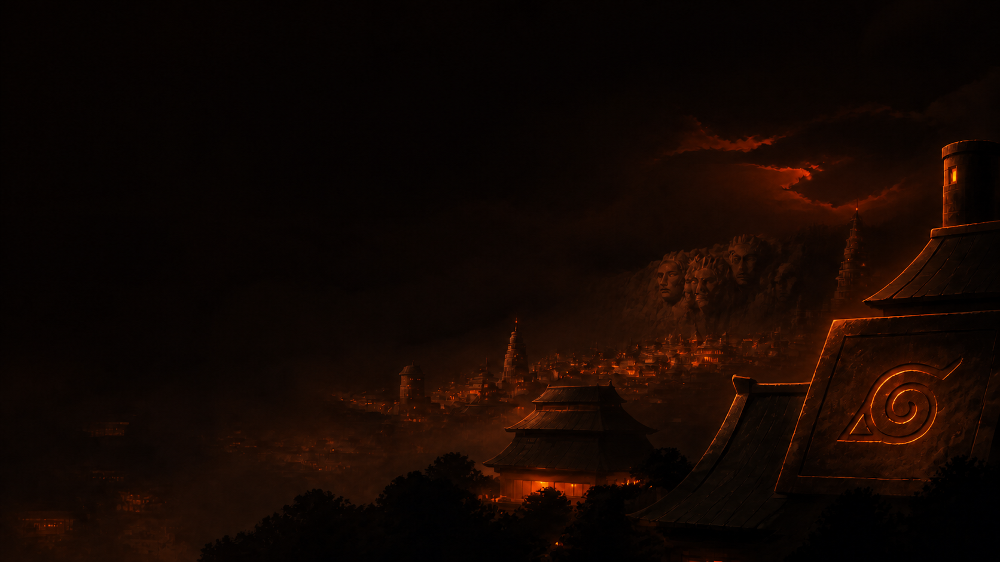

# Konaha Naruto for Omarchy

An unofficial Naruto and Hidden Leaf Village-inspired Omarchy theme built for a
dark, focused developer workstation. Deep black and charcoal surfaces are paired
with warm Naruto orange, restrained crimson, muted Leaf green, and soft cream
text for comfortable long coding sessions.



## Highlights

- Orange-forward, high-contrast developer palette
- Matching Omarchy shell bar, launcher, menus, notifications, lock screen, and
  selection states
- Warm gradient Hyprland borders generated from `colors.toml`
- Seven atmospheric night wallpapers, including three ramen-alley compositions
- Generated terminal, editor, browser, TUI, and shell colors through Omarchy's
  supported theme templates

## Install

Install directly from the public Git repository:

```bash
omarchy theme install https://github.com/phuclh/omarchy-konaha-naruto-theme.git
```

You can also paste the repository URL into **Install > Style > Theme** from the
Omarchy menu.

Cycle through the included wallpapers with:

```bash
omarchy theme bg next
```

## Terminal opacity

For security, Omarchy does not install terminal configuration files supplied by
remote theme repositories. Terminal colors are generated safely from
`colors.toml`, but opacity remains controlled by each user's local terminal
configuration or user-wide Omarchy templates.

The author's full local edition uses 92% terminal opacity. To reproduce that
look, set your terminal background opacity to `0.92` in your local terminal
configuration after installing the theme.

## Palette

| Role | Color |
| --- | --- |
| Background | `#100A07` |
| Dark background | `#090604` |
| Foreground | `#F0D8C1` |
| Accent | `#F07818` |
| Selection | `#4A2410` |
| Crimson | `#D65A3A` |
| Leaf green | `#7E9A62` |

## Wallpapers

1. Hokage Rock at night
2. Hidden Leaf forge
3. Chakra eclipse
4. Original ramen alley
5. Wider ramen alley
6. Wide single-alley composition
7. Softer single-alley composition

## Compatibility

This distribution is designed for the current Omarchy theme system. Remote
themes are intentionally color-only: Omarchy discards executable Lua, terminal
configs, and VS Code extension instructions, then regenerates supported files
from `colors.toml`.

## Disclaimer

This is an unofficial fan-made theme. It is not affiliated with, endorsed by,
or sponsored by Masashi Kishimoto, Shueisha, TV Tokyo, Studio Pierrot, or the
owners of Naruto. Naruto, Konoha, and related names and symbols belong to their
respective rights holders.

See [LICENSE](LICENSE) and [NOTICE.md](NOTICE.md) for licensing details.
